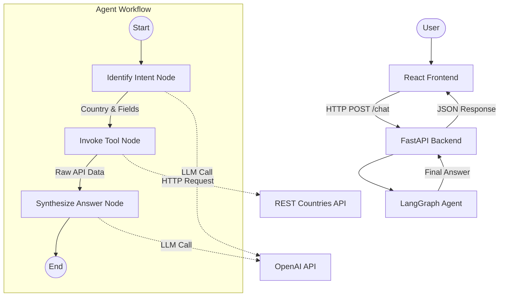

# Country Information AI Agent Architecture

This document describes the high-level architecture of the Country Information AI Agent. The system uses **LangGraph** for orchestration, **LangChain** for LLM interactions, **FastAPI** for the backend API, and **React** for the frontend user interface.

## 1. System Overview

The agent is a stateful workflow that processes natural language questions about countries, extracts the intent, fetches real-time data from a public API, and synthesizes a grounded answer.

### Core Technologies
- **Python 3.12+**: Primary programming language for the backend.
- **LangGraph**: Orchestration framework for stateful, multi-step agent workflows.
- **LangChain**: Framework for LLM integration and prompt management.
- **OpenAI (GPT-3.5-turbo)**: Large Language Model for intent extraction and answer synthesis.
- **Pydantic**: Data validation and structured output parsing.
- **FastAPI**: Backend web framework exposing the agent via REST API.
- **React (Vite)**: Frontend library for building the user interface.
- **REST Countries API**: Public data source (`https://restcountries.com/v3.1/`).

## 2. Architecture Diagram

## 3. Component Details

### 3.1 Backend (`api.py`)
The FastAPI application serves as the entry point for the agent. It:
- Exposes a POST `/chat` endpoint.
- Accepts JSON payloads with the user's question.
- Initializes and invokes the LangGraph workflow.
- Returns the agent's synthesized answer and any errors.

### 3.2 State Management (`state.py`)
The `AgentState` is a `TypedDict` that maintains the context throughout the workflow execution. It tracks:
- `question`: The user's original input.
- `country_name`: The extracted country name.
- `requested_fields`: Specific data points requested (e.g., population, capital).
- `raw_data`: The JSON response from the REST Countries API.
- `answer`: The final synthesized answer.
- `error`: Error messages if any step fails.

### 3.3 Nodes (`nodes.py`)
The workflow consists of three primary nodes:

1.  **`identify_intent`**:
    *   **Input**: `question`
    *   **Process**: Uses `ChatOpenAI` with structured output (Pydantic `Intent` model) to extract the target country and requested fields.
    *   **Output**: Updates `country_name` and `requested_fields` in the state.

2.  **`invoke_tool`**:
    *   **Input**: `country_name`
    *   **Process**: Calls the `CountryDataTool` to fetch data from `https://restcountries.com/v3.1/name/{country}`. Handles 404s and API errors.
    *   **Output**: Updates `raw_data` in the state.

3.  **`synthesize_answer`**:
    *   **Input**: `question`, `raw_data`, `requested_fields`
    *   **Process**: Uses an LLM prompt to generate a natural language answer based *only* on the provided `raw_data`. It ensures the answer is grounded in the fetched facts.
    *   **Output**: Updates `answer` in the state.

### 3.4 Tooling (`tool.py`)
A dedicated `CountryDataTool` class encapsulates the logic for interacting with the external API. This ensures separation of concerns and makes it easier to mock the API for testing or swap the data source in the future.

### 3.5 Frontend (`frontend/`)
The React application provides a modern chat interface. It:
- Maintains chat history state.
- Sends user messages to the backend API.
- Renders the agent's responses, including Markdown support for displaying flag images.

## 4. Data Flow

1.  **User Input**: "What is the capital of France?"
2.  **Frontend Request**: `POST /chat` with `{"question": "What is the capital of France?"}`
3.  **Backend Processing**:
    *   **Intent Identification**: LLM extracts `country_name="France"`, `requested_fields=["capital"]`.
    *   **Tool Invocation**: API Request `GET https://restcountries.com/v3.1/name/France`.
    *   **Answer Synthesis**: LLM generates "The capital of France is Paris."
4.  **Backend Response**: Returns JSON `{"answer": "The capital of France is Paris.", "error": null}`.
5.  **Frontend Display**: The answer is added to the chat history and displayed to the user.

## 5. Error Handling

The system is designed to be robust:
- **API Errors**: If the external API is down or the country is not found, the tool node returns an error message.
- **LLM Errors**: If the LLM fails to extract intent, the workflow handles the error gracefully.
- **Backend Errors**: FastAPI catches exceptions and returns appropriate HTTP status codes.
- **Frontend Errors**: The UI displays a user-friendly message if the backend request fails.
