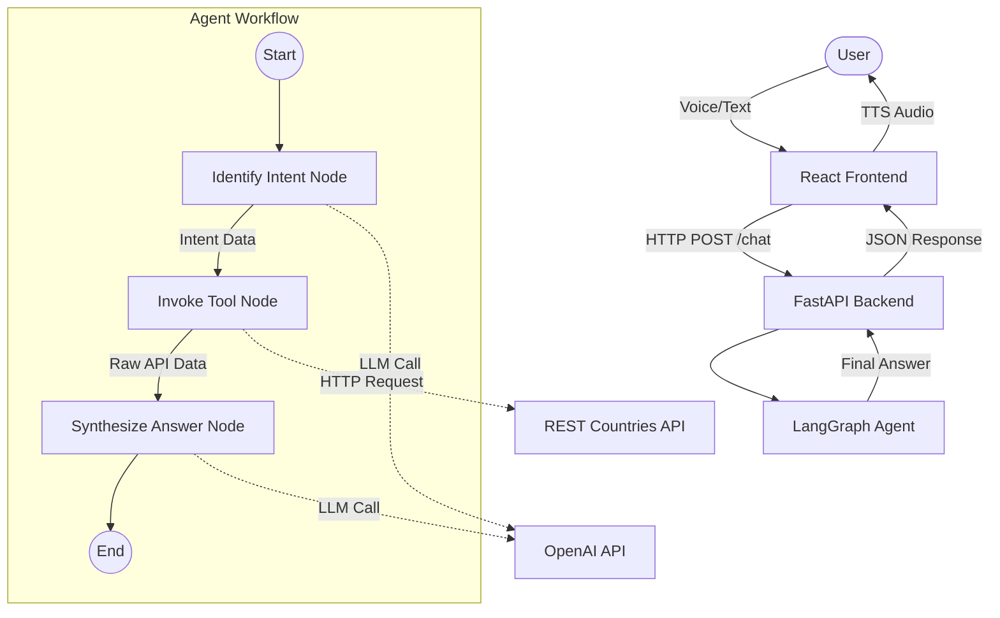

# Country Information AI Agent Architecture

This document describes the high-level architecture of the Country Information AI Agent. The system uses **LangGraph** for orchestration, **LangChain** for LLM interactions, **FastAPI** for the backend API, and **React** for the frontend user interface.

## 1. System Overview

The agent is a stateful workflow that processes natural language questions about countries. It supports various intent types including specific data retrieval, comparisons, rankings, and general summaries. It fetches real-time data from a public API and synthesizes a grounded answer.

### Core Technologies
- **Python 3.12+**: Primary programming language for the backend.
- **LangGraph**: Orchestration framework for stateful, multi-step agent workflows.
- **LangChain**: Framework for LLM integration and prompt management.
- **OpenAI (GPT-3.5-turbo)**: Large Language Model for intent extraction and answer synthesis.
- **Pydantic**: Data validation and structured output parsing.
- **FastAPI**: Backend web framework exposing the agent via REST API.
- **React (Vite)**: Frontend library for building the user interface.
- **Web Speech API**: Browser-native API for Speech-to-Text (STT) and Text-to-Speech (TTS).
- **REST Countries API**: Public data source (`https://restcountries.com/v3.1/`).

## 2. Architecture Diagram

## 3. Component Details

### 3.1 Backend (`api.py`)
The FastAPI application serves as the entry point for the agent. It:
- Exposes a POST `/chat` endpoint.
- Accepts JSON payloads with the user's question.
- Initializes and invokes the LangGraph workflow.
- Returns the agent's synthesized answer and any errors.
- Handles CORS to allow requests from the React frontend.

### 3.2 State Management (`state.py`)
The `AgentState` is a `TypedDict` that maintains the context throughout the workflow execution. It tracks:
- `question`: The user's original input.
- `country_names`: List of extracted country names (supports multiple for comparisons).
- `requested_fields`: Specific data points requested (e.g., population, capital).
- `is_comparison`: Boolean flag for comparison queries.
- `is_ranking`: Boolean flag for ranking queries (e.g., "top 5").
- `is_summary`: Boolean flag for general summary queries.
- `limit`: Integer for the number of items to rank.
- `sort_by`: Field to sort by for ranking queries (e.g., "population", "area").
- `raw_data`: The JSON response from the REST Countries API.
- `answer`: The final synthesized answer.
- `error`: Error messages if any step fails.

### 3.3 Nodes (`nodes.py`)
The workflow consists of three primary nodes:

1.  **`identify_intent`**:
    *   **Input**: `question`
    *   **Process**: Uses `ChatOpenAI` with structured output (Pydantic `Intent` model) to classify the user's intent. It determines if the user wants specific data, a comparison, a ranking, or a summary.
    *   **Output**: Updates state with `country_names`, `requested_fields`, and intent flags (`is_comparison`, `is_ranking`, etc.).

2.  **`invoke_tool`**:
    *   **Input**: State variables (`country_names`, `is_ranking`, etc.)
    *   **Process**: 
        - For **Single/Multiple Countries**: Calls `fetch_data` for each country.
        - For **Rankings**: Calls `fetch_ranking` to get sorted data (e.g., top 5 by population).
        - For **Summaries**: Calls `fetch_data` to get comprehensive details.
    *   **Output**: Updates `raw_data` in the state.

3.  **`synthesize_answer`**:
    *   **Input**: `question`, `raw_data`, `requested_fields`, intent flags.
    *   **Process**: Uses an LLM prompt to generate a natural language answer based *only* on the provided `raw_data`. 
        - Generates Markdown tables for comparisons and rankings.
        - Generates bullet-point lists for summaries.
    *   **Output**: Updates `answer` in the state.

### 3.4 Tooling (`tool.py`)
A dedicated `CountryDataTool` class encapsulates the logic for interacting with the external API.
- **`fetch_data`**: Retrieves data for specific countries.
- **`fetch_ranking`**: Retrieves all countries, sorts them by a specified field (population/area), and returns the top N results.
- **Exact Match Logic**: Ensures accurate data retrieval (e.g., distinguishing "China" from "Indochina").

### 3.5 Frontend (`frontend/`)
The React application provides a modern chat interface.
- **Voice Interaction**: 
    - **Speech-to-Text (STT)**: Converts microphone input to text using the Web Speech API.
    - **Text-to-Speech (TTS)**: Reads the agent's response aloud using the Web Speech API.
- **Markdown Rendering**: Uses `react-markdown` and `remark-gfm` to render tables, lists, and bold text.
- **Chat History**: Maintains a scrollable list of user and agent messages.

## 4. Data Flow Examples

### Example 1: Simple Query
1.  **User**: "What is the capital of France?"
2.  **Intent**: `country_names=["France"]`, `requested_fields=["capital"]`.
3.  **Tool**: `GET /name/France`.
4.  **Synthesis**: "The capital of France is Paris."

### Example 2: Comparison
1.  **User**: "Compare the population of India and China."
2.  **Intent**: `country_names=["India", "China"]`, `requested_fields=["population"]`, `is_comparison=True`.
3.  **Tool**: `GET /name/India`, `GET /name/China`.
4.  **Synthesis**: Generates a Markdown table comparing the populations.

### Example 3: Ranking
1.  **User**: "Top 5 most populated countries."
2.  **Intent**: `is_ranking=True`, `limit=5`, `sort_by="population"`.
3.  **Tool**: Fetches all countries, sorts by population, returns top 5.
4.  **Synthesis**: Generates a numbered list or table of the top 5 countries.

## 5. Error Handling

The system is designed to be robust:
- **API Errors**: Handles 404s (Country not found) and 500s gracefully.
- **Intent Failures**: If intent cannot be determined, asks the user for clarification.
- **Missing Data**: If the API returns incomplete data, the agent acknowledges the limitation instead of hallucinating.
